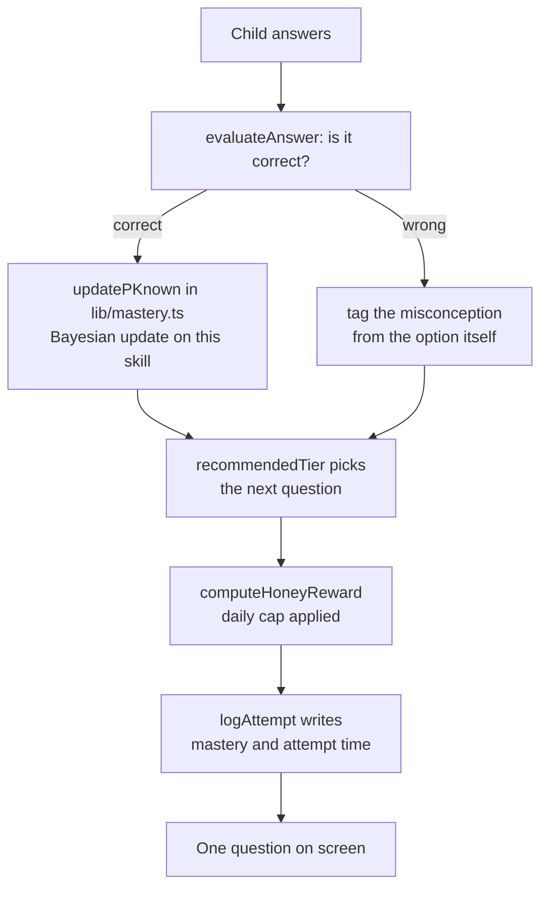
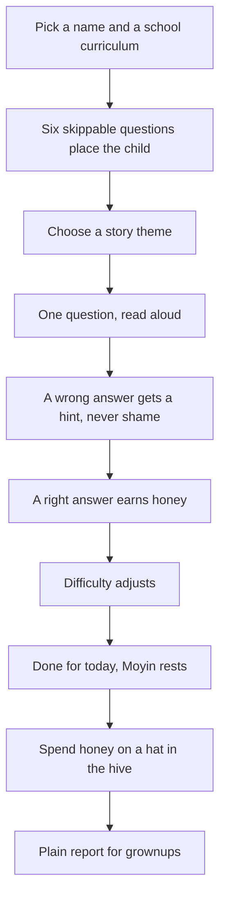

<div align="center">

# moye

**A child who cannot read the room is not the problem. A lesson that rushes them is.**

Moye is a free, offline learning app for ADHD, dyslexia and neurotypical kids. One question at a
time, read aloud on request, no timer and no buzzer. Moyin the honey badger sits beside the child the
whole way, and any lesson can be stopped at any moment without losing anything.

**[Play it](https://moye-bay.vercel.app)** &nbsp;·&nbsp;
**[How Moye decides](https://moye-bay.vercel.app/proof)** &nbsp;·&nbsp;
**[What Moye keeps](https://moye-bay.vercel.app/privacy)** &nbsp;·&nbsp;
**[What is real](WHAT_IS_REAL.md)**

[](https://nextjs.org)
[](https://react.dev)
[](https://www.typescriptlang.org)
[](https://tailwindcss.com)
[](#scripts)
[](#accessibility)
[](LICENSE)

</div>

---

## Contents

- [The idea](#the-idea)
- [Try it in 90 seconds](#try-it-in-90-seconds)
- [Why it is different](#why-it-is-different)
- [One question at a time](#one-question-at-a-time)
- [Any lesson can be stopped](#any-lesson-can-be-stopped)
- [How Moye decides](#how-moye-decides)
- [The demo path](#the-demo-path)
- [Offline is the normal case](#offline-is-the-normal-case)
- [Built for children](#built-for-children)
- [Accessibility](#accessibility)
- [Tech stack](#tech-stack)
- [Getting started](#getting-started)
- [Scripts](#scripts)
- [Project structure](#project-structure)
- [What is real](#what-is-real)
- [FAQ](#faq)

---

## The idea

Most learning apps are built around the clock and the scoreboard. A child who stalls gets a red
flash, a buzzer, and a streak that quietly starts punishing them. The advice is to try harder.

Moye takes the opposite position. **The lesson adapts to the child, never the child's effort to the
lesson.** There is no timer anywhere in the product. A wrong answer gets a hint and Moyin looking
patient, never a punishment and never a dropped score. Difficulty moves because the app worked out
what the child actually understands, not because a minute ran out.

Everything Moye decides is arithmetic in a plain function you can read. There is no model in the
loop at all.

## Try it in 90 seconds

**[moye-bay.vercel.app](https://moye-bay.vercel.app)** — no signup, no install, works on a phone.

The home page has a real question in it. Answer it and the card underneath changes to show what
Moye just decided about that answer and why. Then:

| Go to | What happens |
| --- | --- |
| `/start` | Six skippable questions find the real starting level. Skip them and a child starts at the beginning. |
| `/lesson?level=s1` | One question at a time, read aloud on request. Answer wrong and a hint appears. |
| `/learn` | The path map. Difficulty has already moved. Tap Comfort to change spacing, text size and motion. |
| `/proof` | The same decision logic run on committed cases, with the working shown. |
| `/grownups` | A plain-language weekly summary, measured from real attempt times. |

Two things worth trying. Turn on **Reading friendly spacing** mid lesson and watch the text change
without losing your place. Then stop the lesson with **Stop for now**: the honey you earned is still
in your hive afterwards.

## Why it is different

|                                | A typical drill app                   | Moye                                                                       |
| ------------------------------ | ------------------------------------- | -------------------------------------------------------------------------- |
| What runs the lesson           | A countdown and a streak multiplier   | One question on screen. No clock exists in the product.                    |
| What a wrong answer does      | Flashes red, docks points             | Offers a hint. Moyin waits. Nothing is lost.                               |
| What decides the next question | Difficulty, or a model's guess        | Bayesian knowledge tracing in `lib/mastery.ts`, covered by unit tests      |
| What a model may decide        | Often the answer itself               | Nothing. There is no model call anywhere in the runtime code.              |
| Where progress lives           | An account on someone else's server   | This device. No account, no cookies, no analytics, no third-party request. |
| How you can check it           | Trust the badge                       | `/proof` runs the real functions on committed cases; `pnpm claim:verify` re-derives 40 claims |
| If the network is gone         | Reduced, or broken                    | Unchanged. The demo path is walked in tests with the network off.          |
| If the child wants to stop     | Finish the set                        | "Stop for now" or `Escape`, keeping every answer already given.            |

## One question at a time

Focus Mode shows a single question with large answer targets and Moyin beside it. The constraints
are structural, not stylistic, and each one has a test behind it:

- **No timer, no countdown, no per-question clock.** There is no timing code on the lesson path.
- **Read aloud on every question** through the browser's speech API, with a voice speed the child sets.
- **Difficulty adapts per skill.** After every answer the app updates what it believes the child
  knows and picks the next question from that.
- **A worked example, then it fades.** One solved example per skill, read aloud, with the steps
  withdrawn as the child gets it.
- **Review comes back gently.** A skill that slipped, or has been quiet for a week, is offered once
  more. Missed days rest the Spark and never show guilt copy.
- **Honey has a daily cap.** It exists to buy a hat for Moyin, not to make a child come back.
- **Energy check-in and focus tools.** Breathe with Moyin, name a feeling, split work into chunks.
  Never graded.

The bank is 90 questions across 14 skills and 8 levels: four maths levels and four reading levels
covering letter sounds, blending, sight words, rhyme, syllables and reading a sentence.

## Any lesson can be stopped

This one is worth calling out, because getting it wrong is the failure mode that matters most for
this audience.

A lesson used to have Pause, and nothing else. A child who wanted out had no way out, which quietly
contradicts every other promise the product makes. Now there is a **Stop for now** control beside
Pause on every question and on the paused screen, and `Escape` leaves the lesson too.

Stopping is not punished and costs nothing:

- Every answer is written to the store as it is given, so the honey and mastery already earned are
  kept.
- There is no "are you sure" gate, which would only add a hurdle.
- There is no lost-streak warning, because a streak that punishes a child for stopping is the
  behaviour we are removing.
- It lands on the path map, which has its own way home.

## How Moye decides

Everything that has to be right is a plain function. Which tier a question is, how much honey is
awarded, whether a streak rests, whether a level unlocks: these are arithmetic in `lib/`, called
directly by the unit tests, never a prompt.



Two surfaces let you check that instead of trusting it.

**`/proof`** runs the same functions on committed cases and shows the working in Moye's own words:
a normal case, a case that looks wrong but is fine, and one the app must refuse. It is titled
"How Moye Decides" because that is what a parent would call it.

**`pnpm claim:verify`** re-derives 40 claims straight from the shipped code and writes
[`evidence/claim-ledger.md`](evidence/claim-ledger.md). Move a threshold in `lib/` and it fails, so
nothing in this README can quietly stop being true.

> The scaffold leftovers are named so nobody credits them by accident: `lib/kernel.ts` and
> `evidence/campaign-report.json` describe a reconciliation kernel for a different domain. They are
> not Moye's decision logic, and no Moye number comes from them.

## The demo path



That path is 20 steps and it is executed as a test, online and then again with the network switched
off, so a regression in any step fails the build.

## Offline is the normal case

`DEMO_MODE=1` runs the whole app against committed fixtures with no database and no network, and the
health endpoint reports it. Save Moye to the home screen and it becomes an installable PWA: after the
first visit the lessons open with the network off.

[`/privacy`](app/privacy/page.tsx) states exactly what is stored and what never happens. Those
promises are enforced by seven tests that grep the repository for analytics libraries, cookies,
remote storage, cross-origin requests and remote profile creation, and that check every storage key
named on the page is a real one. Adding a tracker fails the build rather than quietly making the
page a lie.

What is kept, all on the device: learning progress, Comfort settings, the chosen language, and the
last energy check-in.

## Built for children

- No account, no signup, no email address, no password, no ads.
- No analytics, no trackers, no cookies, and no request to any third-party server.
- No guilt copy. A Spark that cannot be kept simply rests, and Moyin says something kind.
- No label says a child failed. A wrong answer offers a hint, and a tired child is told they are done.
- No quiet loss-framing, no fake scarcity, and no "come back or lose your streak".
- Sound is off by default and remembered either way.
- A child's name is never used to build a profile of them.
- The demo identity is a first name typed on the spot. No real data anywhere.

## Accessibility

Built in from the first screen rather than added after, and checked rather than asserted.

- Lexend throughout, with a real OpenDyslexic option. Both fonts are served by this app, so dyslexia
  spacing also works offline.
- One Comfort control on every screen: dyslexia spacing, larger text, tinted backgrounds, a reading
  line guide, word highlight while reading aloud, Calm Motion, sound and voice speed.
- Calm Motion and the operating system's reduced-motion setting both stop every animation, pause the
  ambient loops, and force revealed content visible.
- **axe-core over 10 pages at 1280 and 375 px** fails the build on any serious or critical WCAG A or
  AA finding. It currently reports none. The first run reported 23 serious or critical violations
  across those pages, including dark body text on a plum button caused by an unlayered CSS rule
  outranking a Tailwind utility, and honey text at 4.03:1 on its own tint.
- The landing page is separately checked against Moye's own house rules, and a browser probe runs at
  1280, 768 and 375 px with and without reduced motion, failing on a stuck reveal, a running
  animation, a console error or a tap target under 44 px.
- A whole lesson can be finished with the keyboard: `1` to `4` choose an answer, `Enter` moves on,
  `R` reads the question aloud, `P` pauses, `Escape` leaves. The list is in Comfort settings.

## Tech stack

| Area | Choice |
| --- | --- |
| Framework | Next.js 16.3 (App Router), React 19.2 |
| Language | TypeScript 5, strict |
| Styling | Tailwind CSS 4, token based, `app/globals.css` holds the palette and type rules |
| Fonts | Lexend and OpenDyslexic, self-hosted for offline use |
| Content | JSON in `content/`, validated with Zod, generated into `lib/content.generated.ts` |
| Persistence | Device storage through `lib/moye-store.ts`; optional Postgres via Drizzle in `db/` |
| Validation | Zod 4 |
| Voice | Browser Web Speech API, no service, no key |
| Testing | `node:test`, Playwright and axe-core |

## Getting started

### Prerequisites

- Node.js 22 or newer
- pnpm 10

### Install and run

```bash
git clone https://github.com/ayodejiades/moye.git
cd moye
pnpm install
DEMO_MODE=1 pnpm dev
```

Open http://localhost:3000. `DEMO_MODE=1` needs no database, no account and no network, so this is
the fastest honest way to see the app.

### Environment variables

Nothing is required. Copy `.env.example` to `.env` only if you want to change the defaults:

| Variable | Default | Needed for |
| --- | --- | --- |
| `DEMO_MODE` | `0` | Set to `1` to run on committed fixtures with no database |
| `DATABASE_URL` | unset | Optional Postgres connection for the owner of a copy. Moye does not need it |
| `DEPLOY_URL` | `http://localhost:3000` | Used by the keepalive workflow and the demo recorder |

There is no model API key, because the app makes no model calls.

## Scripts

| Command | What it does |
| --- | --- |
| `pnpm dev` | start the app locally |
| `pnpm build` | production build |
| `pnpm start` | serve the production build |
| `pnpm test` | unit tests for the decision logic (10) |
| `pnpm test:landing` | landing page standards: motion, contrast, honesty, semantics (39) |
| `pnpm test:features` | placement, review, scaffolding, energy, focus, classroom, content and the privacy promises (110) |
| `pnpm test:demo-path` | walks the 20-step demo path online **and** with the network off |
| `pnpm test:keyboard` | completes a lesson with no mouse at all |
| `pnpm test:a11y` | axe-core over 10 pages at 1280 and 375; fails on any serious or critical finding |
| `pnpm test:landing:e2e` | browser probe at 1280, 768 and 375, with and without reduced motion |
| `pnpm claim:verify` | re-derives 40 claims from the shipped code and writes `evidence/claim-ledger.md` |
| `pnpm content:sync` | regenerate `content/` from the typed banks, then `pnpm content:build` |
| `pnpm lint` | eslint |

The browser scripts need a running server and Playwright:

```bash
pnpm build && DEMO_MODE=1 pnpm start -p 3111
BASE_URL=http://localhost:3111 pnpm test:demo-path
BASE_URL=http://localhost:3111 pnpm test:keyboard
BASE_URL=http://localhost:3111 pnpm test:a11y
BASE_URL=http://localhost:3111 pnpm test:landing:e2e
```

If a result looks stale, kill the old server first. `pnpm build` does not restart it:

```bash
pkill -9 -f "next-server" && DEMO_MODE=1 pnpm start -p 3111
```

`pnpm test:integration` needs `DATABASE_URL` and is the one check that does not run in demo mode.

## Project structure

```
app/
  page.tsx          landing, with a live answerable question
  start/            name, country, placement quiz, theme
  learn/            path map, review cards, energy check-in
  lesson/           Focus Mode player, worked examples, read aloud
  done/             done for today
  hive/             cosmetics bought with honey, saved as a PNG
  grownups/         class list, plain weekly summary, printable page
  proof/            the decision logic run on committed cases
  privacy/          what is stored, with tests holding it to that
  error, not-found, loading
components/        mascot, Comfort sheet, lesson parts, focus tools
lib/
  mastery.ts        Bayesian update and tier choice
  honey.ts          rewards and the daily cap
  streak.ts         Spark streaks, freezes, rest days
  placement.ts      the six-question placement quiz
  review.ts         spaced review scheduling
  scaffolding.ts    worked example, then fade
  energy.ts         energy check-in
  parent-summary.ts the plain-language weekly summary
  focus-feelings.ts breathing, feelings, chunking
  classroom.ts      who needs a hand today
  lesson-bank.ts    maths levels
  reading-bank.ts   phonics and reading levels
  moye-store.ts     device persistence
  content/          JSON source, Zod schemas, generated module
content/           the content that ships, validated against those schemas
tests/             159 unit and standards tests, plus the browser suites
tools/             content build, claim verifier
evidence/          committed cases and the generated claim ledger
```

## What is real

[`WHAT_IS_REAL.md`](WHAT_IS_REAL.md) marks every part as built, partial or deliberately not wired,
and the boundaries are stated plainly: no timers, no runtime model calls, no monetisation, no guilt
framing and no cloud account.

## FAQ

**Does Moye use AI to decide anything?**

No. There is no model call anywhere in the runtime code. Difficulty, mastery, honey, streaks,
placement and unlocking are plain functions in `lib/`, called directly by unit tests. `/proof` runs
them on committed cases so you can see the arithmetic.

**Can a child get stuck in a lesson?**

No. "Stop for now" sits beside Pause on every question, `Escape` leaves, and every answer already
given is kept. There is no confirmation dialog and no lost-streak warning.

**Does it work without a network?**

Yes, and that is the tested path. The demo path is walked twice in CI, once with the network off. The
app makes no request to any third-party server, which a test enforces by scanning the repository.

**Does my child need an account?**

No. There is no signup and no server-side identity. The optional Postgres connection exists for
someone running their own copy and Moye does not use it.

**How do you know the numbers in this README are true?**

`pnpm claim:verify` re-derives 40 claims from the shipped code and fails if a threshold moves. Every
count above comes from the content in `content/` or from a test that asserts it.

**Is this suitable for a dyslexic reader?**

That is the design brief. Lexend or OpenDyslexic, adjustable letter and word spacing, line height,
tint, a reading line guide, word highlight during read aloud, and text that can be enlarged without
losing the layout. Both fonts are served by the app so all of it works offline.

**Why is `docs/` not in the repository?**

The product spec, the demo path definition and the demo recording are deliberately kept out of the
public tree. Nothing in the app or the checks depends on them being published.

---

<div align="center">
  <sub>moye. Built by Ayodeji Adesegun (<a href="https://github.com/ayodejiades">@ayodejiades</a>) under the MIT License.</sub>
</div>