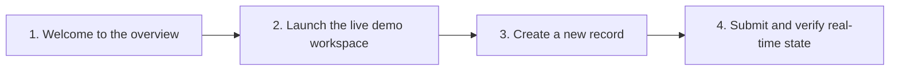
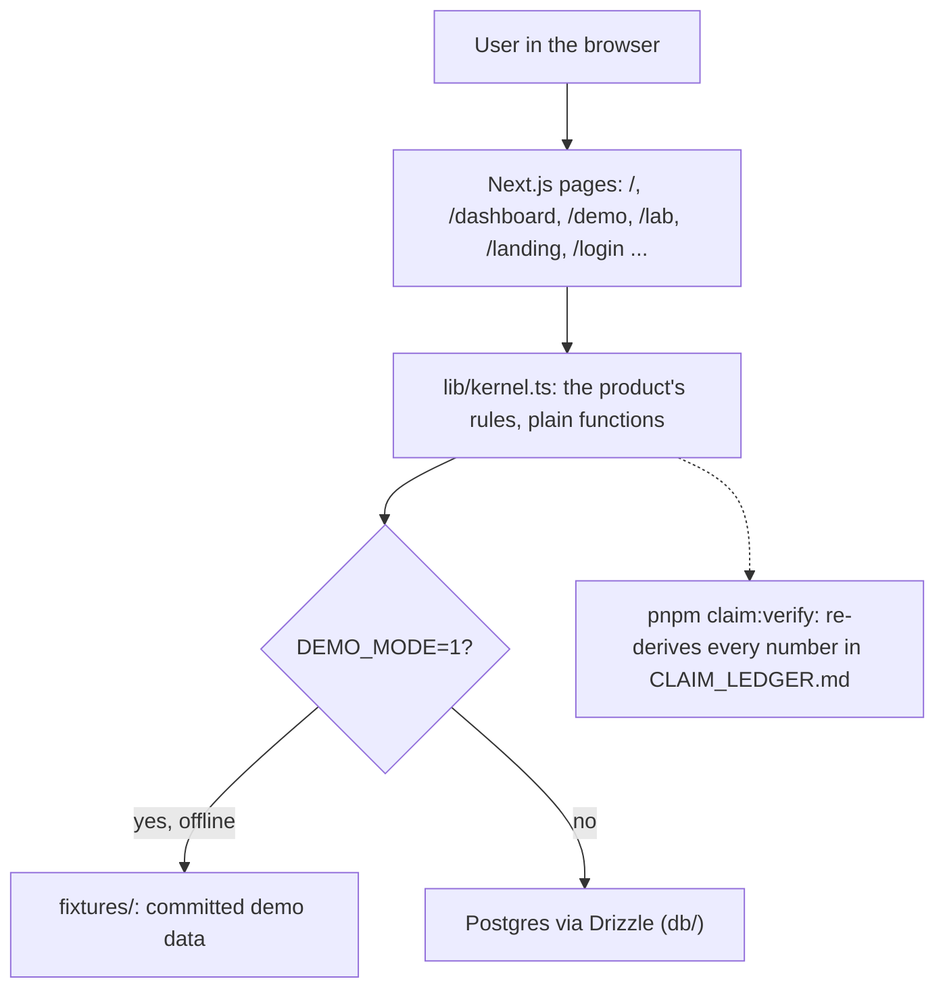

<div align="center">

# moye

**Moye: an adaptive learning app for neurodivergent (ADHD, dyslexia) and neurotypical kids. Mascot Moyin the honey badger. Free stack: Supabase, PWA, browser speech.**

[](LICENSE)
[](package.json)
[](#try-it)

[Demo script](docs/DEMO_PATH.md) &nbsp;|&nbsp; [Evidence](docs/EVIDENCE.md) &nbsp;|&nbsp; [How it works](#how-it-works)

</div>


---

## Why moye exists

Moye: an adaptive learning app for neurodivergent (ADHD, dyslexia) and neurotypical kids. Mascot Moyin the honey badger. Free stack: Supabase, PWA, browser speech.

## Try it

```bash
pnpm install
DEMO_MODE=1 pnpm dev
```

Open http://localhost:3000. Demo mode runs the app on committed fixtures, with no database, account or network. The demo script is in [`docs/DEMO_PATH.md`](docs/DEMO_PATH.md), and how each number was checked is in [`CLAIM_LEDGER.md`](CLAIM_LEDGER.md).

## How it works

The demo path, step by step:



Architecture:



Next.js and TypeScript, with Drizzle for data. The product's rules live in `lib/kernel.ts` as plain functions, so the same input always gives the same result and the tests call them directly. Recorded runs live in `evidence/campaign-report.json`.

## Run it

| Command | What it does |
| --- | --- |
| `pnpm dev` | start the app locally |
| `pnpm build` | production build |
| `pnpm test` | run the automated tests |
| `pnpm claim:verify` | re-derive every claim in CLAIM_LEDGER.md from the committed data |

## What is real

What is built, partial or not wired yet, measured rather than claimed: [`WHAT_IS_REAL.md`](WHAT_IS_REAL.md).

## Credits

Assets and open-source attributions are listed in [`CREDITS.md`](CREDITS.md).

---

<div align="center">
  <sub>moye. Built by Ayodeji Adesegun (<a href="https://github.com/ayodejiades">@ayodejiades</a>) under the MIT License.</sub>
</div>
