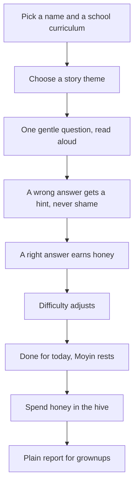
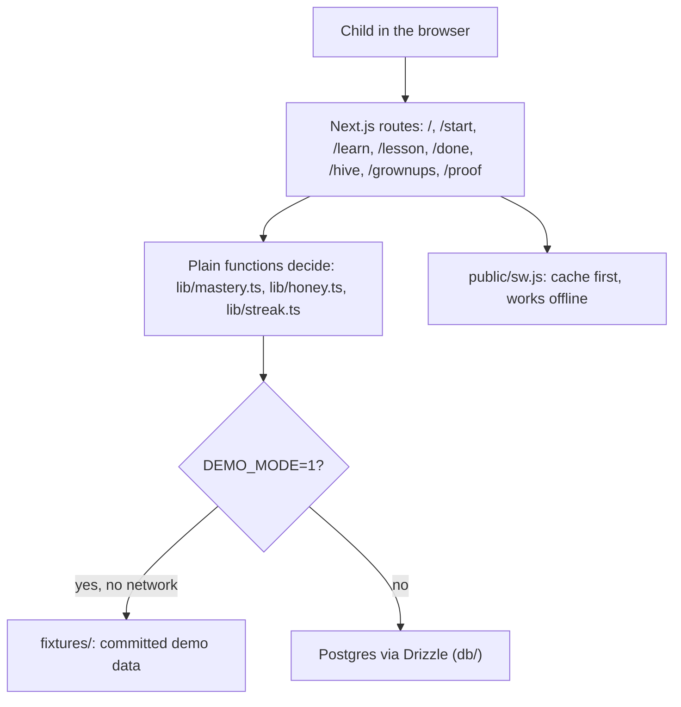

<div align="center">

# moye

**Moye: short, gentle lessons that adjust to each child, with no timers and no shame. Moyin the honey badger sits beside them the whole way. Built for ADHD, dyslexia, and neurotypical kids.**

[](LICENSE)
[](package.json)
[](#run-it)

[Demo path](docs/DEMO_PATH.md) &nbsp;|&nbsp; [What is real](WHAT_IS_REAL.md) &nbsp;|&nbsp; [How it works](#how-it-works)

</div>


---

## The problem

Many learning apps rush children with a clock, a buzzer, and a scoreboard. Moye shows one gentle
question at a time, adjusts the difficulty from plain arithmetic rather than a chatbot, and never
shames a wrong answer.

## What it does

- **One question at a time.** No countdown, no buzzer, no red flashing. Read aloud on every question.
- **Difficulty that adapts.** After each answer the app updates what the child has understood and
  picks the next question from that. It is arithmetic in `lib/mastery.ts`, not a model call.
- **Honey rewards with a daily cap.** Children earn honey only for finished focus work and spend it
  on Moyin's hive. A daily cap tells them when they are done for today.
- **Calm Motion, dyslexia spacing, tinted backgrounds, voice speed.** One Comfort settings button on
  every screen, and the settings follow the child from page to page.
- **Works offline.** Save Moye to the home screen. After the first visit the lessons open with the
  network switched off, and there is not a single request to a third party.
- **Plain reports for grownups.** Where the child was confident, what needs gentle support, and how
  that maps to the classroom curriculum.

## Try it

```bash
pnpm install
DEMO_MODE=1 pnpm dev
```

Open http://localhost:3000. Demo mode runs the app on committed fixtures with no database, no
account, and no network.

## How it works

The demo path, step by step:



Architecture:



The rules that decide pass or fail, honey, streaks and rest tokens are plain functions in
`lib/mastery.ts`, `lib/honey.ts` and `lib/streak.ts`. The same input always gives the same result,
and the unit tests call them directly. `/proof` runs that same logic on committed cases and shows
the working, in the product's own words rather than as a wall of maths.

> Note: `lib/kernel.ts` and `evidence/` come from the shared project scaffold and describe a
> reconciliation kernel for a different domain. They are not Moye's decision logic, and no Moye
> number comes from them.

## Run it

| Command | What it does |
| --- | --- |
| `pnpm dev` | start the app locally |
| `pnpm build` | production build |
| `pnpm test` | unit tests for the decision logic (10) |
| `pnpm test:landing` | landing page standards: motion, contrast, honesty, semantics (39) |
| `pnpm test:demo-path` | walks `docs/demo-path.json` online **and** with the network off |
| `pnpm test:keyboard` | completes a lesson with no mouse at all |
| `pnpm test:landing:e2e` | runs the browser probe at 1280, 768 and 375, with and without reduced motion |
| `pnpm lint` | eslint, zero warnings |
| `pnpm claim:verify` | re-derives the scaffold evidence fixtures |

The end to end scripts need a running server and Playwright:

```bash
pnpm build && DEMO_MODE=1 pnpm start -p 3111
BASE_URL=http://localhost:3111 pnpm test:demo-path
BASE_URL=http://localhost:3111 pnpm test:keyboard
```

## Accessibility

Built in from the first screen, not bolted on afterwards.

- Lexend throughout, with a real OpenDyslexic option. Both fonts are served by this app, so
  dyslexia spacing also works offline.
- Comfort settings on every screen: dyslexia spacing, extra large text, tinted backgrounds, a
  reading line guide, word highlight while reading aloud, Calm Motion, sound, and voice speed.
- Calm Motion and the operating system's reduced motion setting both stop every animation, pause
  the ambient loops, and force all revealed content visible.
- Every colour pair on the landing page is checked against WCAG AA by `pnpm test:landing`.
- A whole lesson can be finished with the keyboard: `1` to `4` choose an answer, `Enter` moves on,
  `R` reads the question aloud, `P` pauses. The list is in Comfort settings.

## What is real

What is built, partial, or deliberately not wired is written down in
[`WHAT_IS_REAL.md`](WHAT_IS_REAL.md), including the boundaries: no timers, no runtime model calls,
no monetisation, no guilt framing, and no cloud account.

## Credits

Assets and open-source attributions, including the OpenDyslexic font, are in
[`CREDITS.md`](CREDITS.md).

---

<div align="center">
  <sub>moye. Built by Ayodeji Adesegun (<a href="https://github.com/ayodejiades">@ayodejiades</a>) under the MIT License.</sub>
</div>
